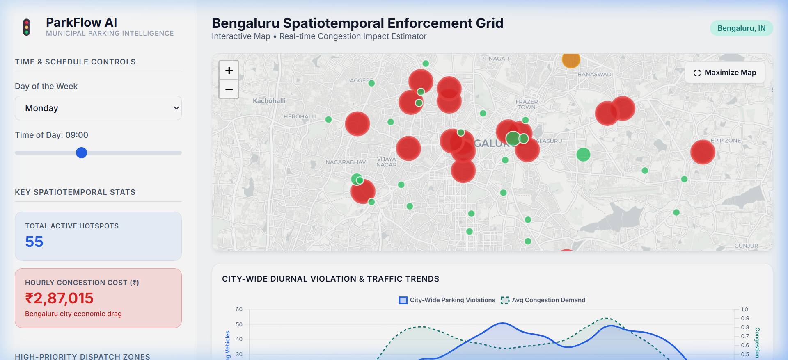
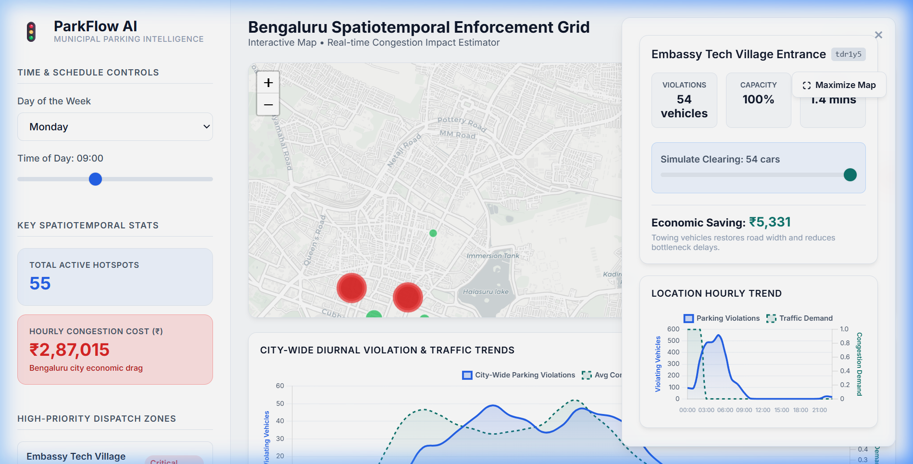

# 🚦 ParkFlow AI — Parking Congestion Intelligence System

> **Flipkart Gridlock Hackathon 2.0 — Round 2 Prototype Submission**

[](https://python.org)
[](https://flask.palletsprojects.com/)
[](#1-ml-prediction-engine-phase-1)
[](https://leafletjs.com/)
[](https://chartjs.org/)

ParkFlow AI is an end-to-end intelligent traffic management system that combines **machine learning demand prediction** with a **real-time interactive dashboard** to help municipal authorities identify, prioritize, and resolve illegal parking hotspots that cause urban congestion.

---

## 🎯 Problem Statement

Illegal parking in dense urban corridors reduces effective road capacity, creating bottleneck congestion that cascades across entire road networks. Current enforcement is reactive and resource-inefficient — officers patrol randomly instead of being dispatched to the highest-impact locations. 

**ParkFlow AI** transitions enforcement from reactive to predictive by estimating spatial-temporal traffic demand and calculating the exact economic and delay impacts of illegal parking hotspots.

---

## 🖥️ Live Dashboard Preview

| **Interactive Hotspot Map (Bengaluru)** | **Location Inspector & What-If Simulation** |
|:---:|:---:|
|  |  |
| *Color-coded enforcement zones showing Leaflet-based spatial clusters with dynamic intensity scaling.* | *Detail view with diurnal demand curves, priority ranking, and real-time congestion mitigation slider.* |

---

## 💡 Key Features

### 1. ML Prediction Engine (Phase 1)
A high-performance **ensemble model** combining LightGBM, XGBoost, and CatBoost to predict traffic demand at any location and time:
* 🗺️ **Spatial Feature Engineering** — Geohash decoding to lat/long + K-Means clustering ($K=15$)
* 🕒 **Cyclic Temporal Encoding** — Trigonometric sine/cosine hour & day encoding to preserve continuous time boundaries
* 📈 **Out-of-Fold Target Encoding** — Leakage-free historical baseline demand mapped to spatiotemporal slots
* ⚖️ **5-Fold Cross-Validation Blending** — Weighted ensemble optimizing prediction stability across highly variable congestion windows

### 2. Intelligent Bottleneck Engine (Phase 2)
The backend dynamically processes prediction values and real-world violation stats using custom traffic metrics:
* ⚙️ **Congestion Drag Index (CDI)**: $\text{CDI} = \frac{\text{Demand}}{\text{Remaining Capacity}}$ where capacity is reduced by $7\%$ for every illegally parked vehicle (max $65\%$ reduction).
* 🚨 **Targeted Enforcement Priority (TEP)**: $\text{TEP} = \text{Violations} \times \text{CDI}$. Auto-ranks the top enforcement hotspots for municipal action.
* 💸 **Economic Loss Estimation**: Calculates the real-time financial drain on commuters, assuming a baseline time-value of ₹300/hour for affected travelers.

### 3. Interactive Dashboard Web App
* 🗺️ **Dynamic Leaflet Map** — Real-time interactive map showing color-coded hotspots, map resizing options, and live animations.
* 🎛️ **What-If Congestion Simulator** — Interactive slider allowing operators to simulate clearing $N$ vehicles and instantly view simulated economic savings (₹), delay reductions, and capacity restorations.
* 📊 **Chart.js Dual Analytics** — Dynamic charts displaying the selected geohash's demand vs. violations alongside Bengaluru's average city-wide diurnal demand curve.

---

## 🏗️ Project Structure

```
ml project/
├── data/
│   ├── dataset/              # Train/test CSV files
│   └── parking/              # Parking stats & traffic demand lookup
├── training/
│   └── train_pipeline.py     # Full ML training pipeline (LGB + XGB + CatBoost)
├── prototype/
│   ├── server.py             # Flask backend with REST APIs & Bottleneck Engine
│   ├── templates/
│   │   └── index.html        # Dashboard HTML template
│   └── static/
│       ├── app.js            # Frontend JS (Map rendering, Chart.js, simulator)
│       └── style.css         # Modern dark-themed CSS styling
├── results/
│   └── submission.csv        # Final predictions (41,778 rows)
├── Approach.md               # Detailed ML modeling approach document
├── Traffic_Demand_Prediction_Submission.ipynb  # Documented Jupyter Notebook
├── requirements.txt          # Python dependencies
└── README.md                 # This file
```

---

## 🚀 How to Run Locally

### Prerequisites
* Python 3.10+
* `pip` package manager

### 1. Clone the repository
```bash
git clone https://github.com/HarshwardhanBhaskar/flipkart-gridlock-parkflow-ai.git
cd flipkart-gridlock-parkflow-ai
```

### 2. Install dependencies
```bash
pip install -r requirements.txt
```

### 3. Start the Dashboard
```bash
cd prototype
python server.py
```

### 4. Access the App
Open your browser and navigate to:
👉 **[http://127.0.0.1:5000/](http://127.0.0.1:5000/)**

---

## 🛠️ Tech Stack

* **ML Algorithms**: LightGBM, XGBoost, CatBoost
* **Backend Framework**: Flask (Python)
* **Frontend Design**: HTML5, Custom Vanilla CSS3 (responsive grid + dark mode theme)
* **Map Engine**: Leaflet.js (CartoDB DarkMatter tiles)
* **Charts Engine**: Chart.js (v4)
* **Data Processing**: Pandas, NumPy, Scikit-learn

---

## 👨‍💻 Developer & Team

* **Team**: **HB Technologies** (Solo Participant)
* **Author**: Harshwardhan Bhaskar

